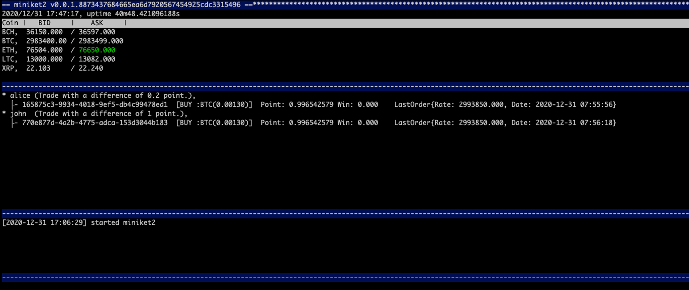

miniquet2
===

* vouquet の小さい版。mini vouquet
	* [vouquet](https://github.com/vouquet/vouquet) の 取引システムのみ分離した仕組み
	* 取引ロジックの評価などを独立して行う事が目的の仕組み
* miniquet は、vouquet開始きっかけのプログラム名。本仕組みは初版だが、2
* 現在は、gmo coinに対応
* 利用は自己責任です

#### Setup

* `~/miniquet2`等で configファイルを用意する
	```
	ApiKey = "<your api key>"
	SercretKey = "<your secret key>"
	```


### Exec

### miniquet2

* 完全自動取引ツールです。仮想通貨のレバレッジ自動取引をおこないます
* [@bitcoin20210208](https://twitter.com/bitcoin20210208) で、取引内容を共有しています
* バイナリの公開はありません

```
user@host:~$ miniquet2 [-c <config path>]
```


### miniquet2-term

* 半自動取引ツールです。現物取引のエントリを手動作成し、その取引を基準に自動取引を行います
* バイナリをリリースで公開しています

```
user@host:~$ miniquet2-term [-c <config path>] [-r <record storage path>]
```


* UIは、3分割しています
	* 上
		* 現在のレートを表示
	* 真ん中
		* 取引中の情報を表示
		* Trader名、説明が表示され、その子要素として動作中の取引が表示されます
			* Trader毎に、取引ロジックが異なります
			* 子要素には、UUIDが表示され、オペレーション時に使用します
	* 下
		* ログ
* `:`を入力することで、コマンドモードによるオペレーションが可能です

#### Operation

* 取引の追加
	* `add <trader name> <symbol> <size> <buy rate>`
		* 取引を追加します。初回は買いで参加します
			* 指数取引のようにレート指定がありますが、計算の判定のみに値は仕様します。実際の注文は成行注文で行います
		* 例
			* `:add alice BTC 0.013 2981200`
* 取引の停止
	* `stop <trader name> <id>`
		* 対象を停止予定にします。次に取引を実施した後、停止します
		* 例
			* `:stop alice 165875c3-9934-4018-9ef5-db4c99478ed1`
	* `kill9 <trader name> <id>`
		* 対象を緊急停止します。入力後、即時停止します
		* 例
			* `:kill9 alice 165875c3-9934-4018-9ef5-db4c99478ed1`

### Bug report

* [Issueの作成](https://github.com/vouquet/miniquet2/issues/new) してください

### Setps2Release

1. sourceの取得
	```
	git checkout master
	git checkout -b release/0.0.1
	```
2. vendoring
	```
	cd ./docker
	make run godep; make stop
	```
	* sshが直接通らない構成にしてるなら下記でライブラリを取得する
		```
		cd src/go/src/miniquet2/vendor/github.com/vouquet
		git clone git@github.com:vouquet/brain.git
		```
3. build
	```
	cd ./docker
	make run gobuild; make stop
	make clean
	```
